this is a physics simulation app. with a Go backend and a Threejs frontend

the goal is to simulate the position, velocity, size, shape, etc of objects accurately through time. focus on only mechanical solid things right now.

to do:
thermo.md complete with proofs
understand the code
camera selection
multi simulation frontend
- inelastic collision
- rotation

TO DO:
viewer: camera control. lock on objects. get their position, radius, and set to look at them.
new: use **A** and **D** keys to cycle locked targets. the camera snaps to the nearest object at start and moves to a good viewing distance.

# MERMAID DIAGRAM

```mermaid
flowchart TD
    classDef pure fill:#ccffcc;
    classDef state fill:#ffebcc;
    classDef io fill:#ffcccc;

    subgraph Layer0[Foundation]
        Vector3
        VecOps:::pure
    end

    subgraph Layer1[Mesh]
        Mesh
        NewMesh:::pure
        ComputeAABB:::state
        ComputeVolume:::state
        FlattenMesh:::pure
        NewBox:::pure
        NewSphere:::pure
        NewHollowRectFrame:::pure
    end
    VecOps --> Mesh
    NewMesh --> ComputeAABB
    NewMesh --> ComputeVolume
    NewBox --> NewMesh
    NewSphere --> NewMesh
    NewHollowRectFrame --> NewMesh

    subgraph Layer2[Object]
        Object
        NewObject:::pure
        DeepCopy:::pure
        FlattenObject:::pure
        UpdateObject:::state
        StepBack:::state
        AABBOverlap:::pure
        TriangleOverlap:::pure
    end
    Mesh --> Object
    TriangleOverlap --> AABBOverlap

    subgraph Layer3[World]
        World
        Frame
        NewWorld:::pure
        FlattenWorld:::pure
        UpdateWorld:::state
        AllPairs:::pure
        Overlaps:::pure
    end
    Object --> World
    UpdateWorld --> AllPairs
    UpdateWorld --> Overlaps
    Overlaps --> AABBOverlap
    UpdateWorld --> UpdateObject
    UpdateWorld --> ElasticCollisionResponse:::state
    UpdateWorld --> UniversalGravitationResponse:::state

    subgraph Layer4[Recording]
        Recording
        NewRecording:::pure
        EncodeRecordingBinary:::pure
        DecodeRecordingBinary:::pure
        Simulate:::io
    end
    World --> Recording
    Simulate --> UpdateWorld
    Simulate --> EncodeRecordingBinary

    subgraph APILayer
        GetRecordingHandler:::io
        NewRouter:::io
    end
    Recording --> GetRecordingHandler
    NewRouter --> GetRecordingHandler

    subgraph ExampleWorlds
        BillardBall:::pure
        SimulateBillardBall:::io
        ThreeBody:::pure
        SimulateThreeBody:::io
    end
    BillardBall --> NewRecording
    ThreeBody --> NewRecording
    SimulateBillardBall --> Simulate
    SimulateThreeBody --> Simulate

    subgraph EntryPoint
        main:::io
    end
    main --> SimulateBillardBall
    main --> SimulateThreeBody
    main --> NewRouter
```

